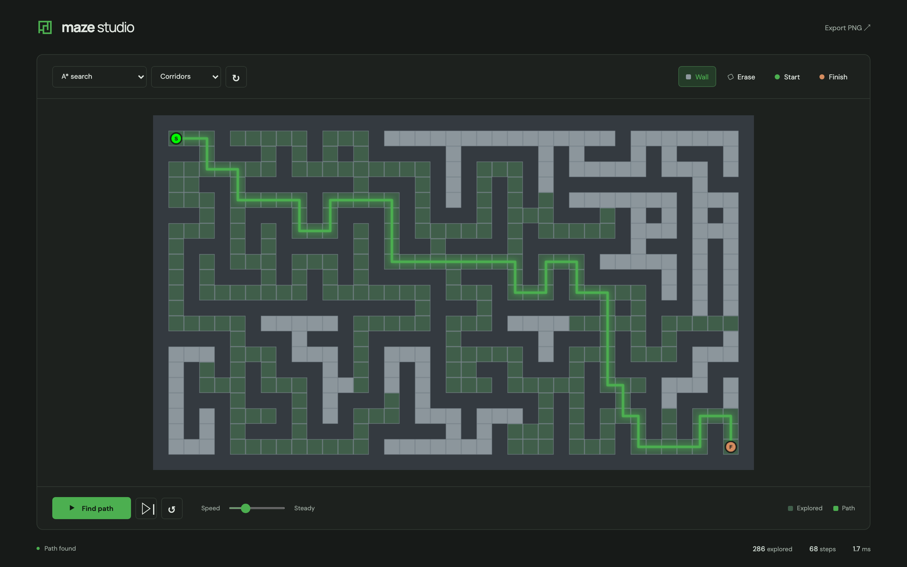

# Maze Studio

A maze editor and animated pathfinding playground. Built with plain HTML, CSS, and JavaScript, with no build step.



Draw walls, move endpoints, or generate a maze. Choose from six algorithms: A*, breadth-first, depth-first, Dijkstra, greedy best-first, and bidirectional BFS. Pause, step through the search, adjust its speed, or export the result as a PNG.

## Run

```sh
python3 -m http.server 8000
```

Open http://localhost:8000.

## Controls

W draws walls, E erases, S moves the start, and F moves the finish. Space plays or pauses. On the focused grid, use arrow keys and Enter to edit.

## Tests

```sh
node --test tests/solver.test.cjs
```
